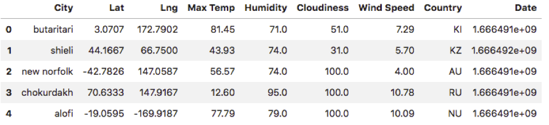

## Best-Vacation-Spots

Map Visualization of Best Vacation Spots using APIs

During this project, I used concepts that I have learned about Python requests, APIs and JSON traversals to complete two challenges, WeatherPy and VacationPy to find out what the weather is like as we approach the equator. For WeatherPy, I created a Python script to visualize the weather of over 500 cities of varying distance from the equator. Using the Python library Citipy, the OpenWeatherMap API and problem-solving skills, I created a representative model of weather across cities. For VacationPy, I used my weather data skills to plan future vacations. I used Jupyter gmaps and the Google Places API to narrow down the cities found in part 1 based on ideal weather conditions for a vacation. I then created a heat map that also displays the hotel closest to these ideal vacation spots.

### Dataset:

 [Weather API](https://openweathermap.org/api),  [Google Maps API](https://mapsplatform.google.com/)

## Objective #1: Weather 

### Step 1 - Generate Cities List 

* Create list of cities from a random set of latitudes and longitudes using citipy

### Step 2 - Perform API Calls

* Perform weather check on each city using a series of successive API calls
    * Include print log of each city as it's being processed (with the city number and city name)

### Step 3 - Convert Raw Data to DataFrame

*  Export the city data into a .csv
*  Display the DataFrame 

### Step 4 - Plot the Data 

* This scatterplot shows the relationship between the city's latitude and the maximum temperature

* This scatterplot shows the relationship between the city's latitude and the humidity

* This scatterplot shows the relationship between the city's latitude and the cloudiness

* This scatterplot shows the relationship between the city's latitude and the wind speed

### Step 5 - Linear Regressions 

    

* After viewing these two plots, the linear regression is modeling that there is a strong negative correlation between max temp and latitude in the Northern Hemisphere, while there is a strong positive correlation between max temp and latitude in the Southern Hemisphere.
    

    

* After viewing these two plots, the linear regression is modeling that there is no correlation between humidity and latitude in the Northern and Southern Hemispheres.
    

    

* After viewing these two plots, the linear regression is modeling that there is a weakly positive correlation between cloudiness and latitude in the Northern Hemisphere, while there is no correlation between cloudiness and latitude in the Southern Hemisphere.
    

    

* After viewing these two plots, the linear regression is modeling that there is a weakly positive correlation between wind speed and latitude in the Northern Hemisphere, while there is no correlation between wind speed and latitude in the Southern Hemisphere.

---------------------------------------------------

## Objective #2: Vacation

### Step 1 - Store Part I results into DataFrame

* Load the csv exported in Part I:Weather into a DataFrame

### Step 2 - Humidity Heatmap

* Configure gmaps
* Use the Lat and Lng as locations and Humidity as the weight
* Add Heatmap layer to map

### Step 3 - Create New DataFrame Fitting Weather Criteria

*  Narrow down the cities to fit weather conditions
    * A max temperature lower than 80 degrees but higher than 70
    * Wind speed less than 10 mph
    * Zero cloudiness
*  Drop any rows will null values

### Step 4 - Create Hotel Map

* Add a "Hotel Name" column to the DataFrame
* Set parameters to search for hotels with 5000 meters
* Hit the Google Places API for each city's coordinates
* Store the first Hotel result into the DataFrame
* Plot markers on top of the heatmap

---------------------------------------------------

<b>Contact:</b> antara.choudhury3000@gmail.com
